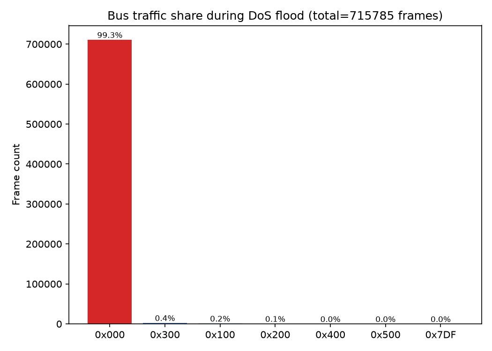
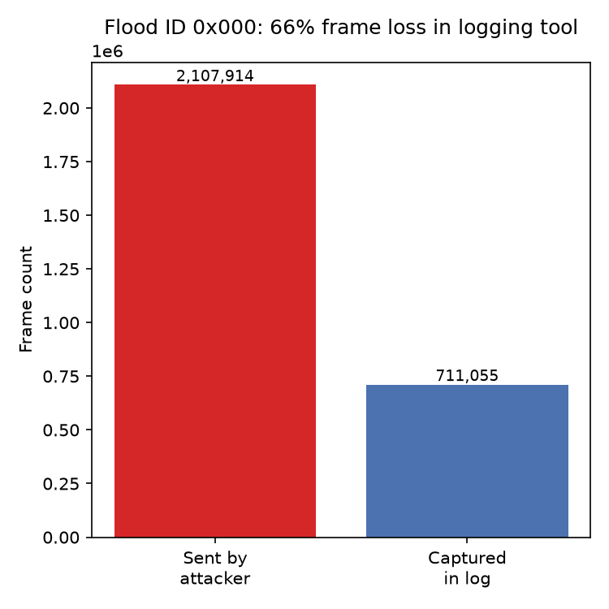

# CAN Security Lab

A hands-on automotive cybersecurity lab demonstrating **replay attacks**,
**message injection**, and **denial-of-service** simulation on a virtual
CAN bus (`vcan0`), paired with detection scripts for each attack and a
full **ISO/SAE 21434-style TARA** (Threat Analysis and Risk Assessment).

Every claim in this repo — every attack, every detection result, every
risk rating — is backed by a script you can run yourself and a captured
log you can inspect. Where the simulation has real limitations (see
[DoS findings](#3-dos-flood-simulation) below), that's stated explicitly
rather than glossed over.

Built as a follow-up to [can-sniffer-analyzer](https://github.com/d0ok/can-sniffer-analyzer),
which covers passive traffic generation, capture, and analysis.

## Why

CAN (Controller Area Network) is the dominant in-vehicle communication
protocol, and it was designed in the 1980s with no message
authentication, encryption, or freshness guarantee. Any node with bus
access can impersonate any other node. This lab demonstrates that
structural weakness concretely, on a safe, fully virtual bus — no real
vehicle or hardware required — and shows what basic detective controls
can and can't catch.

## Repo structure
```text
can-security-lab/
├── scripts/
│   ├── common/        # baseline traffic generator, log parser, lab startup helper
│   ├── attacks/        # replay, injection, DoS attack + impact-analysis scripts
│   └── detection/       # one detector per attack
├── docs/
│   ├── tara/            # ISO/SAE 21434-style TARA (scope, threats, risk matrix)
│   └── plots/            # generated summary charts
├── logs/                # sample captures from each attack
└── requirements.txt
```
## Setup

```bash
sudo apt install -y can-utils python3-venv
sudo modprobe vcan
sudo ip link add dev vcan0 type vcan
sudo ip link set up vcan0

python3 -m venv venv
source venv/bin/activate
pip install -r requirements.txt
```

**Recommended: use the lab startup helper** instead of managing baseline
traffic + capture manually. It starts both, verifies the baseline is
actually producing traffic, and cleans up on Ctrl+C:

```bash
./scripts/common/start_lab.sh logs/my_capture.log
# wait for "LAB READY", then run any attack script in another terminal
```

## Simulated bus layout

| ID    | Signal                  | Domain              | Period  |
|-------|---------------------------|------------------------|---------|
| 0x100 | Engine RPM                | Powertrain             | 20 ms   |
| 0x200 | Vehicle speed              | Chassis                | 50 ms   |
| 0x300 | Steering angle             | Chassis                | 10 ms   |
| 0x400 | Door lock/unlock status    | Body                   | 500 ms  |
| 0x500 | ECU heartbeat/counter      | Network management     | 1000 ms |
| 0x7DF | Diagnostic request (OBD-II) | Diagnostics            | 2000 ms |

## 1. Replay attack

Captures live frames for a target ID, then resends them later —
CAN has no sequence number or timestamp to distinguish a replayed frame
from a real one.

```bash
python3 scripts/attacks/replay_attack.py --id 0x400 \
    --capture-duration 5 --delay 5 --replay-count 5 --replay-interval 0.3
```

**Detection** — learns each ID's normal frame rate from a trusted
baseline, then flags time windows where an ID's rate significantly
exceeds its own baseline (not payload repetition, which turned out to
produce false positives on naturally slow-changing signals — see the
detector's docstring for why):

```bash
cd scripts/detection
python3 detect_replay.py ../../logs/replay_capture_clean.log
```

**Result:** cleanly flagged 15 consecutive anomalous windows for
`id=0x400`, all correctly localized to the actual replay burst, with
zero false positives on the other five IDs.

## 2. Message injection

Two modes:

- **`spoof`** — fabricate frames on an *existing* ID with an
  attacker-chosen value (e.g. forcing RPM to an implausible fixed value)
- **`rogue`** — inject frames on an ID that never appears in legitimate
  traffic at all (simulating a compromised/rogue ECU)

```bash
python3 scripts/attacks/inject_attack.py --mode spoof --id 0x100 --value 8000 --count 30 --interval 0.05
python3 scripts/attacks/inject_attack.py --mode rogue --id 0x666 --count 20 --interval 0.1
```

**Detection** — two independent checks: an unknown-ID allowlist (built
from a trusted baseline), and a per-byte "normal envelope" learned from
the baseline, so signed values wrapping at zero or categorical status
bytes don't trigger false positives the way a naive fixed-width
interpretation did in early development:

```bash
python3 detect_injection.py ../../logs/inject_rogue.log  --baseline-log ../../logs/replay_capture_clean.log
python3 detect_injection.py ../../logs/inject_spoof.log --baseline-log ../../logs/replay_capture_clean.log
```

**Result:** rogue test flagged exactly `0x666`, zero false positives.
Spoof test flagged 60 value-jump alerts, all on `0x100` byte 0, exactly
matching the injected RPM=8000 collisions against real (much lower)
RPM values.

## 3. DoS flood simulation

Floods the bus with a fixed low ID (`0x000`) as fast as possible. On a
**real** CAN bus, the lowest numeric ID always wins arbitration during a
bus collision, so this would starve every other ECU at the electrical
layer. **`vcan0` is a software loopback with no electrical arbitration**,
so this lab measured what a flood *actually* does on a virtual bus,
rather than assuming the real-bus behavior would transfer automatically.

```bash
python3 scripts/attacks/dos_attack.py --id 0x000 --duration 10 --marker-file logs/dos_marker.json
```

### What was tested and found

| Hypothesis | Method | Result |
|--------------|----------|----------|
| Flood degrades legitimate senders' timing | `analyze_dos_impact.py`, before/during/after jitter comparison across 3 IDs | **Not observed** — jitter was *lower* during the flood than baseline on all tested IDs |
| Flood delays a receiver's frame processing | `dos_receiver_impact.py`, per-frame processing-lag measurement | **Not observed** — lag stayed sub-millisecond throughout, even at 700k+ total frames processed |
| Flood causes packet loss in logging tools | Compared attacker's `frames_sent` (marker file) vs. frames actually captured in the log | **Confirmed** — of 2,107,914 frames sent in 10s, only 711,055 (34%) reached the log; kernel netdev stats showed zero drops, meaning the loss occurs in userspace tooling, not the bus/driver layer |

**Honest conclusion:** this simulation does not demonstrate classic
CAN bus-arbitration starvation (vcan0 can't reproduce that), but it does
demonstrate a real and arguably more practically important finding: **a
flood attack can blind logging and monitoring tools during the exact
window an attack is happening**, without needing to affect ECU-to-ECU
delivery at all.




**Detection** — flags any ID responsible for a disproportionate share of
total bus traffic:

```bash
python3 detect_dos.py ../../logs/dos_attack.log
```

**Result:** `0x000` flagged at 99.3% of total bus traffic, ~145,582 Hz
observed rate — unambiguous, no tuning required.

## TARA — Threat Analysis and Risk Assessment

Full write-up in [`docs/tara/`](docs/tara/), structured per **ISO/SAE
21434**:

1. [Scope, Assets & Damage Scenarios](docs/tara/01_scope_and_assets.md)
2. [Threat Scenarios & Attack Feasibility](docs/tara/02_threat_scenarios_and_feasibility.md)
3. [Risk Matrix & Countermeasures](docs/tara/03_risk_matrix_and_countermeasures.md)

**Key finding:** all three spoofing-class threats (replay, value
injection, rogue-ID injection) rate as **Critical risk** — a direct
consequence of CAN 2.0's lack of native message authentication, not a
flaw specific to this lab. The DoS flood rates as **High risk**, with
its actual demonstrated impact being on logging/monitoring availability
rather than bus-wide message delivery (see TARA doc 02 for the full
fidelity discussion).

Every detector built in this lab is **passive, offline, and
detection-only** — none of them prevent an attack in real time, and the
DoS findings show a severe-enough flood could itself blind a live
version of these tools. Recommended preventive controls (message
authentication / AUTOSAR SecOC, gateway segmentation, real-time IDS) are
documented but intentionally out of scope for a software-only lab — see
TARA doc 03 for the full list and reasoning.

## Limitations

- `vcan0` has no electrical layer, so bus-arbitration effects (a core
  part of real CAN DoS) are not reproducible here — see Section 3 above.
- Detectors use simple statistical baselines learned from a single
  trusted capture; a production IDS would need continuous baseline
  updates, redundant capture paths, and more robust anomaly models.
- No message authentication (SecOC) or gateway segmentation is
  simulated — this lab demonstrates the *absence* of those controls,
  not an implementation of them.

 ## Disclaimer

This project is for **educational and research purposes only**, built
and tested entirely on a virtual CAN interface (`vcan0`) with no
connection to any real vehicle, ECU, or hardware. It is intended to
demonstrate CAN bus security concepts in a safe, isolated environment.

Do not use these scripts against any CAN bus, vehicle, or system you do
not own or do not have explicit written authorization to test. Running
these attacks (particularly the DoS flood or injection scripts) against
a real vehicle could cause malfunction, safety hazards, or damage, and
may be illegal depending on your jurisdiction.

The author provides this software "as is", for learning purposes, and
accepts no responsibility for misuse or any damage resulting from its
use. See [LICENSE](LICENSE) for full terms.

## License

MIT
